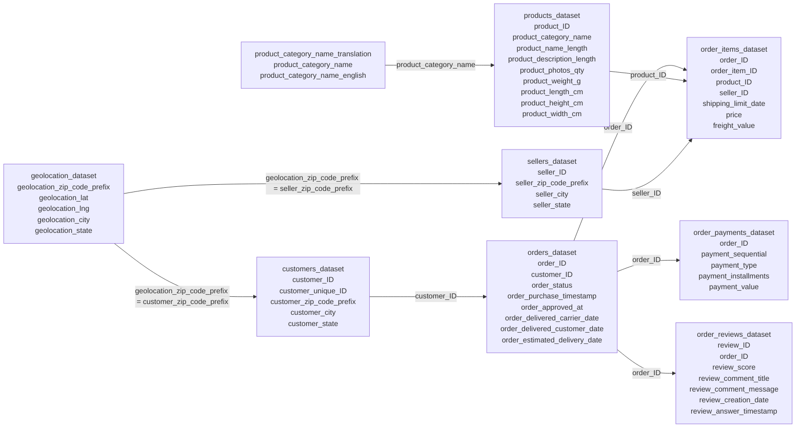

# Integration Diagram

## Relationship Summary

| Parent table | Child table | Join key |
|---|---|---|
| `customers_dataset` | `orders_dataset` | `customer_ID` |
| `orders_dataset` | `order_items_dataset` | `order_ID` |
| `orders_dataset` | `order_payments_dataset` | `order_ID` |
| `orders_dataset` | `order_reviews_dataset` | `order_ID` |
| `products_dataset` | `order_items_dataset` | `product_ID` |
| `sellers_dataset` | `order_items_dataset` | `seller_ID` |
| `product_category_name_translation` | `products_dataset` | `product_category_name` |
| `geolocation_dataset` | `customers_dataset` | `geolocation_zip_code_prefix = customer_zip_code_prefix` |
| `geolocation_dataset` | `sellers_dataset` | `geolocation_zip_code_prefix = seller_zip_code_prefix` |

